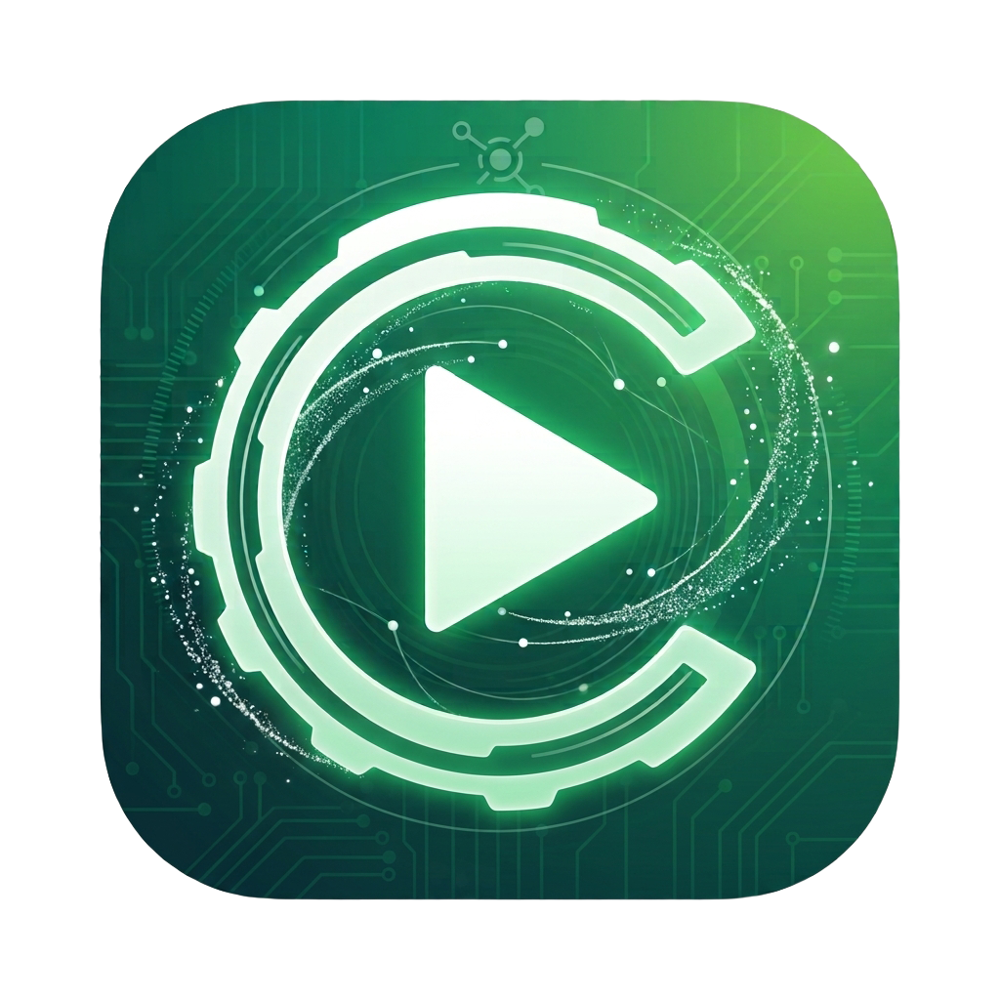

# Nexus CP

**Open-source CarPlay receiver for Android automotive head units.**



## Features

- **Embedded offline MFi** — Certificate and private key are compiled into the app source (no separate asset files).
- **External Wi‑Fi mode (default)** — Car and iPhone join the same external network; no car-as-AP required.
- **Wired USB and wireless CarPlay** — Both connection paths supported.
- **English and Arabic UI** — Full string localization with RTL.
- **Brand CarPlay home icons** — Nexus CP, Hongqi, Geely, Neta, Toyota, Deepal, Arcfox.
- **Head-unit focused settings** — Display scale, FPS, HEVC, audio buffer, wireless link mode.

## Supported Systems

- Hongqi
- Geely
- Neta / Hozon Auto
- Toyota bZ3
- Toyota bZ4
- Deepal (Changan)
- Arcfox (BAIC)

## Build

```bash
git clone https://github.com/ztecjo/nexuscp.git
cd nexuscp
./gradlew assembleDebug
./gradlew assembleRelease
```

Requirements: Android SDK 37, JDK 11+, Gradle wrapper included.

## Sources

Built using open sources from:

- [xcertplay](https://github.com/shilapi/xcertplay/)
- [LIVI](https://github.com/f-io/LIVI)

## License

GPL-3.0
